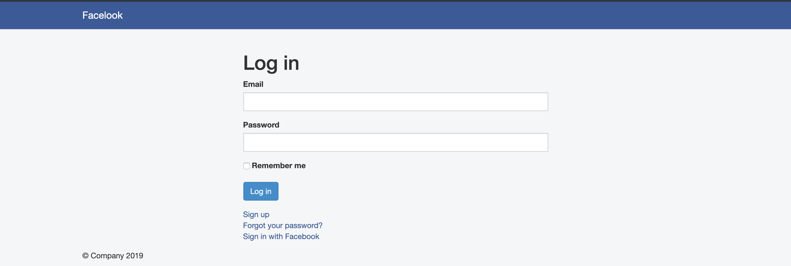
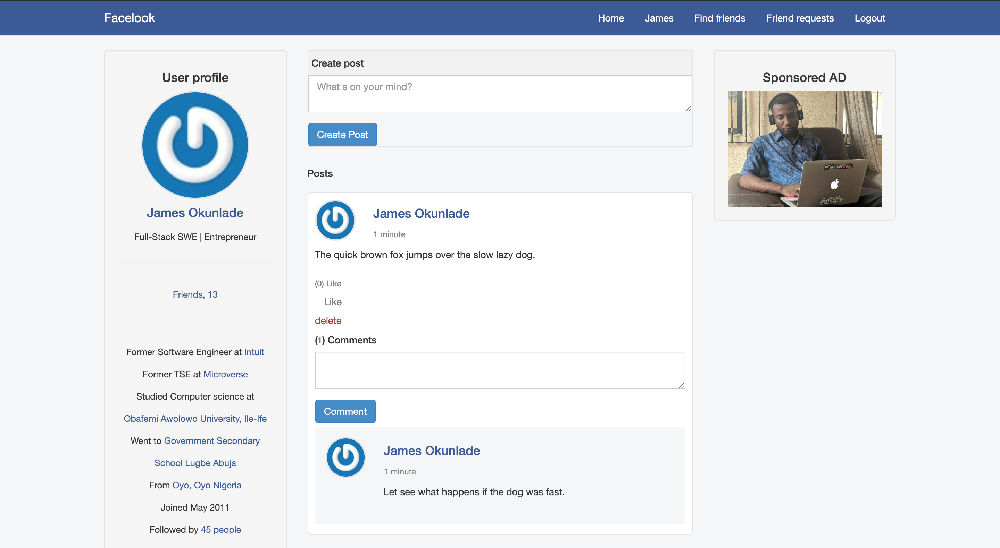

# Facelook

> Facelook. [Live demo]()

## Table of Contents
- [Facelook](#Facelook)
  - [Table of Contents](#table-of-contents)
  - [Background](#background)
  - [Technologies](#technologies)
  - [Framework](#framework)
  - [Requirements](#requirements)
  - [Install](#install)
  - [Future improvement](#future-improvement)
  - [Author](#author)

## Background
Facelook is a clone of the Facebook App built with Ruby on rails and hosted on heroku. We have implemented some of the core features of Facebook such as Users can make friends, post contents and different posts can be liked and commented on by other users etc.

## Technologies
Ruby

## Framework
Ruby on Rails

Bootstrap

## Requirements
Ruby version 2.6.2

Rails version 5.2.3

## Install
> Open your git bash and **cd** to the location you'd like to put your files the run the command below.

`git clone https://github.com/JamesOkunlade/facelook`

**cd** to into the project folder and install using `bundle install --withoutproduction`

`rails db:migrate`

To start the server: `rails server`

## Future improvement

- Change the frontend to React.js
- Implement live chat with friends

## Author

[James Okunlade](https://github.com/JamesOkunlade)

[Adnan Afsari](https://github.com/AdnanAfsari)
